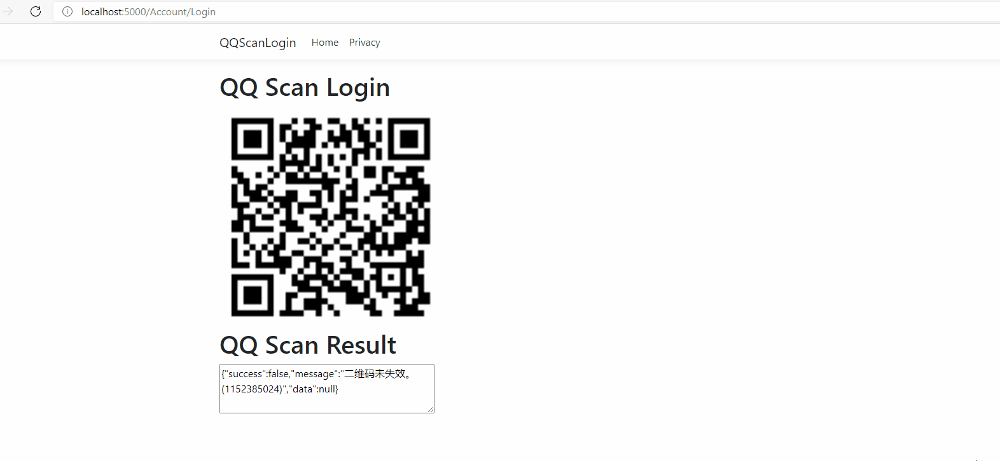

[TOC]

# QQ 扫码登录的实现（无需注册开发者）

## 效果展示：



## 核心实现

### 展示二维码

```csharp
public static (Stream, string) GetLoginQrCode()
{
    var uri = new Uri(QrCodeUrl);
    var request = new HttpRequestMessage(HttpMethod.Get, uri);
    var cookieContainer = new CookieContainer();
    var handler = new HttpClientHandler
    {
        CookieContainer = cookieContainer,
        AllowAutoRedirect = true,
        UseCookies = true
    };
    using var client = new HttpClient(handler);
    var response = client.Send(request);
    var stream = response.Content.ReadAsStreamAsync().Result;
    var cookies = cookieContainer.GetCookies(uri).ToList();
    var qrsig = cookies.FirstOrDefault(x => x.Name == "qrsig")?.Value;
    return (stream, qrsig);
}
```

### 解析扫码结果

```csharp
public static (bool, string, ScanResult) GetQqScanResult(string qrsig)
{
    var timeStamp = GetTimeStamp();
    var ptqrToken = ParsePtqrToken(qrsig);
    var uri = new Uri(string.Format(ScanResultUrl, ptqrToken, timeStamp));
    var request = new HttpRequestMessage(HttpMethod.Get, uri);
    var cookieContainer = new CookieContainer();
    cookieContainer.Add(new Cookie("qrsig", qrsig) { Domain = uri.Host });
    var handler = new HttpClientHandler
    {
        CookieContainer = cookieContainer,
        AllowAutoRedirect = true,
        UseCookies = true
    };
    using var client = new HttpClient(handler);
    var response = client.Send(request);
    var content = response.Content.ReadAsStringAsync().Result;
    var result = ParsePtuiCbResult(content);
    return result[0] == "0" ? (true, result[4], new ScanResult(ParseQqNumber(result[2]), result[5])) : (false, result[4], null);
}
```

### 登录视图

```html
<h1>QQ Scan Login</h1>


<h1>QQ Scan Result</h1>

<textarea rows="3" cols="45" id="result"></textarea>

<form asp-action="Login" method="post" id="loginForm">
    <input type="hidden" name="nick" id="nickName" />
    <input type="hidden" name="number" id="qqNumber" />
</form>
```

## 登录授权

### 配置Cookie认证策略

```csharp
services.AddAuthentication(CookieAuthenticationDefaults.AuthenticationScheme)
    .AddCookie(options =>
    {
        // options.Cookie.HttpOnly = true;
        // options.ExpireTimeSpan = TimeSpan.FromHours(2);
        // options.SlidingExpiration = true;

        options.LoginPath = "/Account/Login";
        options.AccessDeniedPath = "/Account/Login";
    });
```

不要忘记使用策略： `app.UseAuthentication();`

### 创建用户登录标识

```csharp
if (ModelState.IsValid)
{
    // 创建用户登录标识，Cookie名称与IServiceCollection中配置的一样即可
    var identity = new ClaimsIdentity(CookieAuthenticationDefaults.AuthenticationScheme);
    // 添加之后，可使用User.Identity.Name获取该值
    identity.AddClaim(new Claim(ClaimTypes.Name, model.Nick));
    // identity中还可以添加自定义数据
    identity.AddClaim(new Claim("qq", model.Number));
    // var customValue = User.Claims.SingleOrDefault(s => s.Type == "qq").Value;
    await HttpContext.SignInAsync(new ClaimsPrincipal(identity));

    return Redirect("~/");
}
```

### 用户退出登录

```csharp
await HttpContext.SignOutAsync();
```

